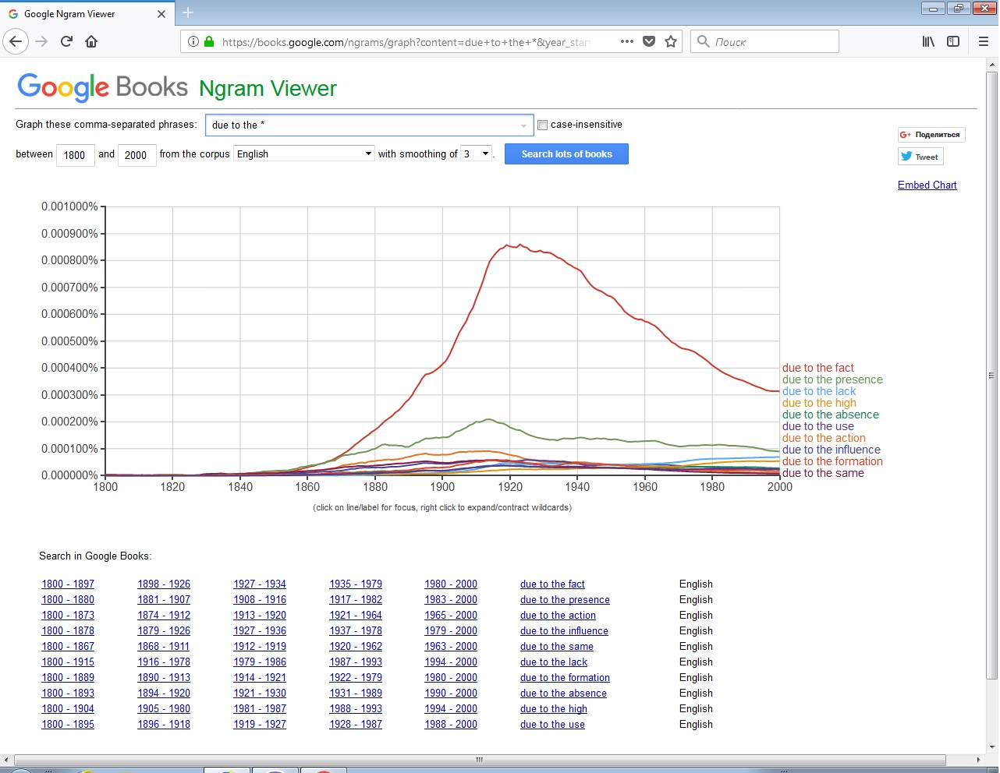
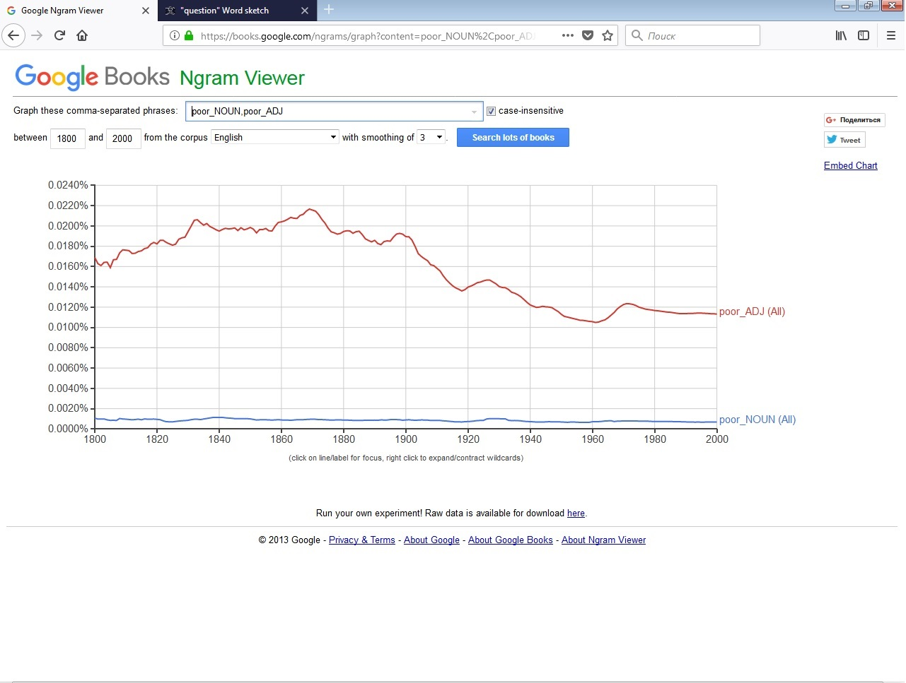
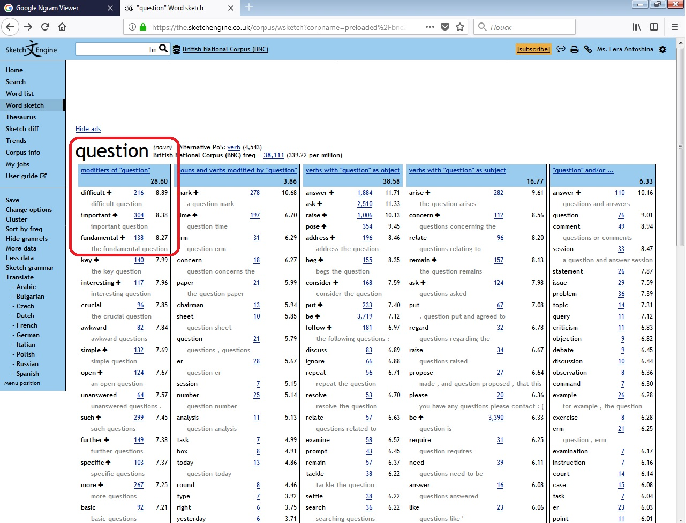
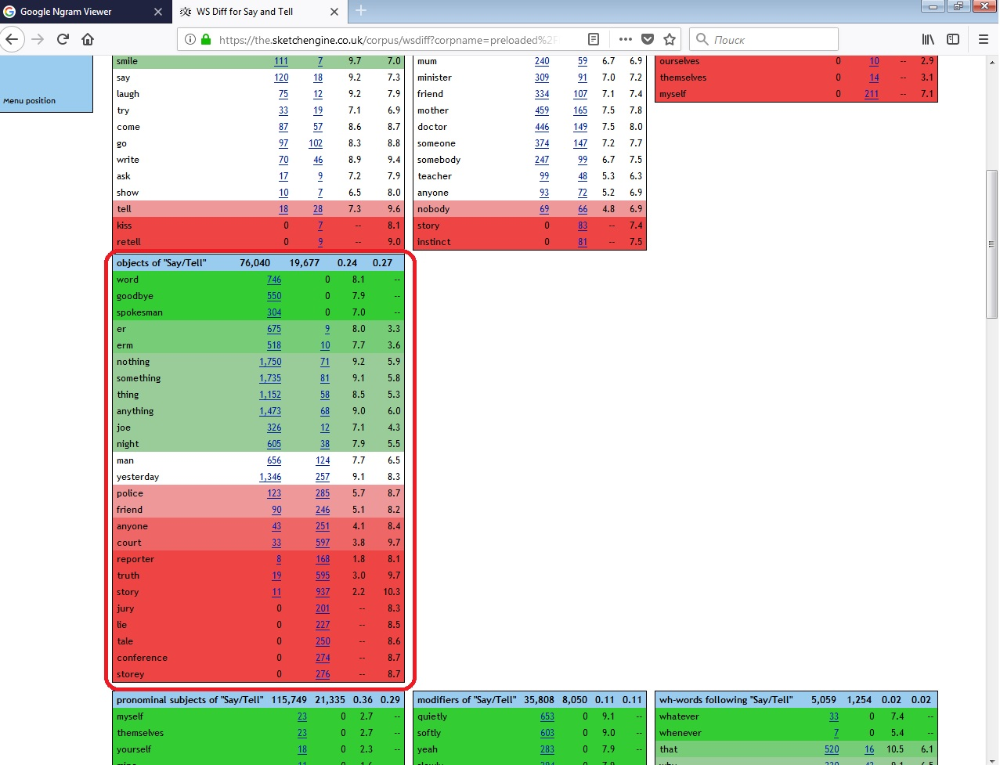
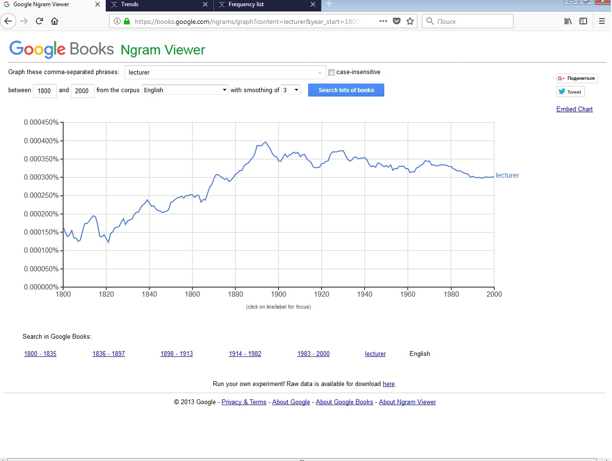
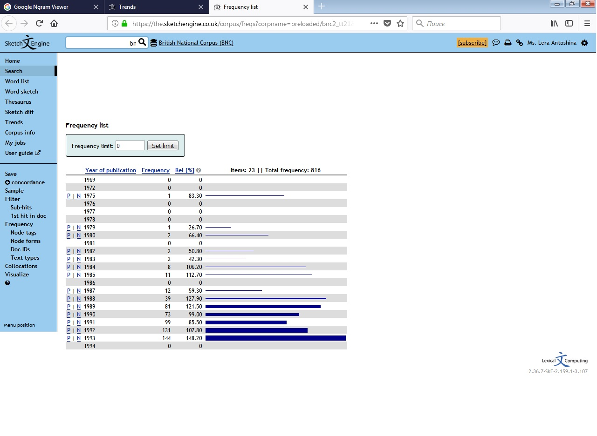

# Домашнее задание №6

## Часть 1. Google Ngram Viewer

1. __10 самых частотных продолжений фразы "due to the".__

2. __Cлово, которое может одновременно относиться к различным частям речи.__

3. __Два синонима "cookie" и "biscuit"__

 ___Выводы:___
 

## Часть 2. Sketch Engine

1. __Три самых частотных модификатора существительного "question".__

2. __Дополнения (objects) к глаголам "Say/Tell".__

3. __Изменение частотности слова "lecturer" в Google Ngrams и SketchEngine.__

