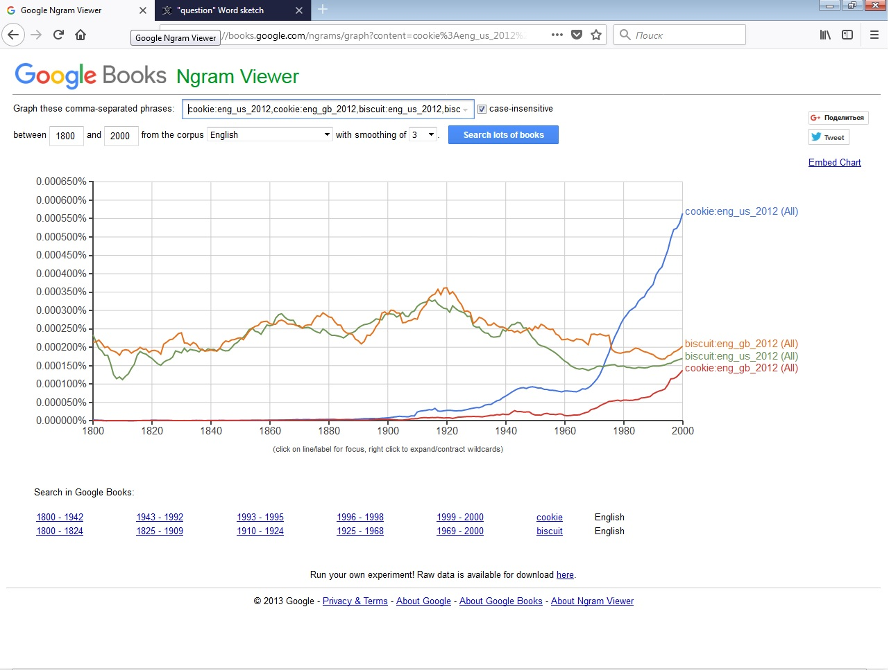

# Домашнее задание №6

## Часть 1. Google Ngram Viewer

1. __10 самых частотных продолжений фразы "due to the".__

2. __Cлово, которое может одновременно относиться к различным частям речи.__

3. __Два синонима "cookie" и "biscuit"__

 ___Выводы:___
 
1. Фраза "due to the" чаще всего используется в случаях , когда мы показываем причину чего-либо обобщенно, является аналогом к русским предлогам "из-за", "по причине" . Не так часто используется ,когда мы объясняем причину . 
2. Слово "poor"("бедный") чаще всего употребляется в качестве прилагательного , нежели существительного , так как оно имеет множество разных значений , таких как "неприятный", "незначительный". Эквивалентом существительного к "poor" ("бедняк") являются слова "pauper", "beggar".
3. С 1900 по 2000 мы наблюдаем , что количество использования слова "cookie" превзошло "biscuit". Слово "biscuit" употреблялось реже ,так  как представляет собой один вид печенья, чаще всего оно жесткое , в отличие от "cookie" , которое подразумевает под собой сладость , с различными вариантами добавок (шоколад,изюм и тд.)
## Часть 2. Sketch Engine

1. __Три самых частотных модификатора существительного "question".__

2. __Дополнения (objects) к глаголам "Say/Tell".__

3. __Изменение частотности слова "lecturer" в Google Ngrams и SketchEngine.__

